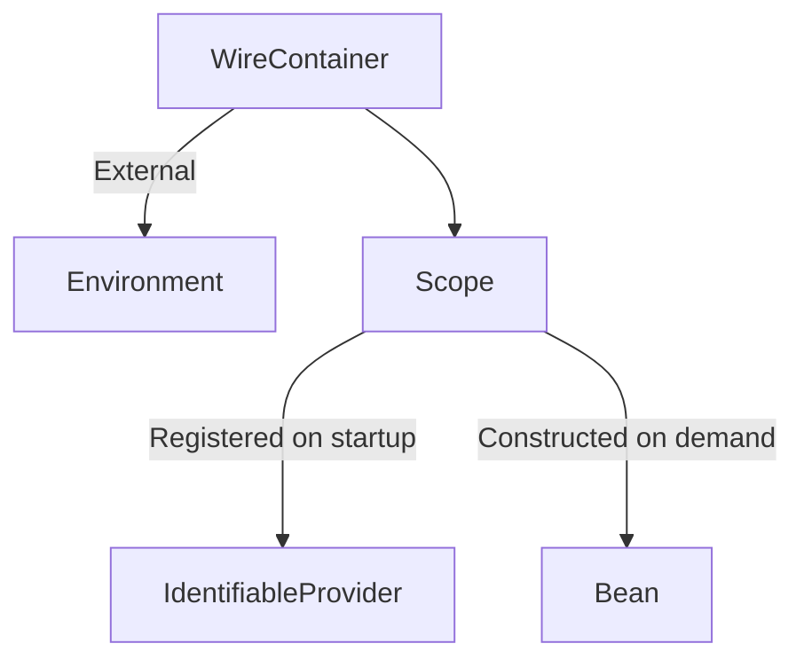
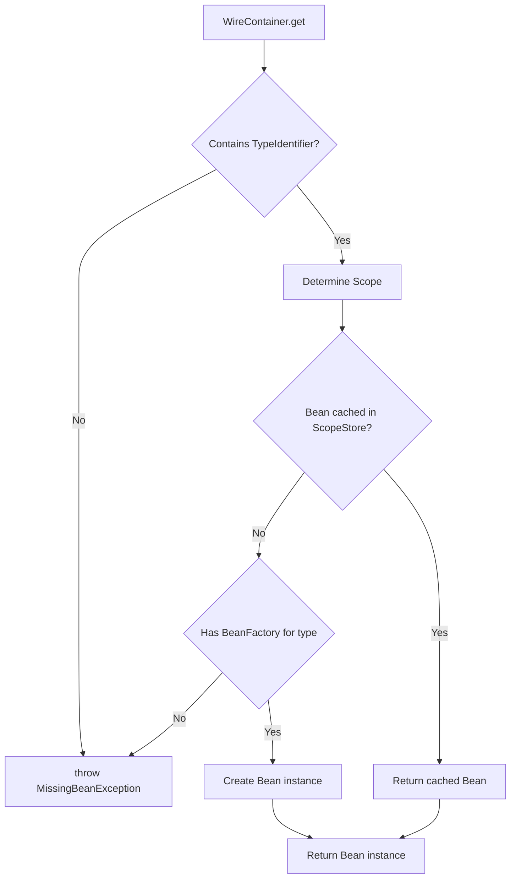

# WireDI Release Candidate 4 Changelog

## Overview

This release focuses on significant architecture enhancements, introducing scoping mechanisms, and a more robust container API.
It represents a major step towards a stable, production-ready dependency injection framework.

With this change, we enter the last release candidate before 1.0.0 and established the final architecture.

The primary changes you'll notice in this RC are connected to the IOC container architecture.
To support Scopes and to be more in line with the default naming schema, a lot has been reworked under the hood.

## Major Changes

### Refactored Container Architecture

The general architecture of the IOC container has been reworked to the following architecture:

Perviously, a Bean was a collection of all instances from a single type.
Now, a bean is a single instance, provided by an IdentifiableProvider.
Scopes have replaced this concept of Beans.

The IdentifiableProvider is now able to register a scope for its beans on startup through the `scope` method.
With the new `processor-plugin-scopes`, this method is generated based on the `jakarta.inject` scopes annotations.

The following diagram illustrates how a bean now is instantiated when requested from the container:

From the outside world, not too much should change.

To reflect the new standard, the `WireRepository` was renamed to `WireContainer`.
Even though the repository feels iconic for us, it was confusing for some people.
The name `WireContainer` reflects that it is a stateful IOC container.
In addition to the rename, it gained a lot more dependencies for diagnostics and configurations.
And to make your lives even easier, it now has a builder for ease of instantiation.

### Condition Evaluation Enhancements

Condition evaluation has been altered slightly.
To allow detailed debugging, a `ConditionEvaluationReporter` bean can be provided to the `WireContainer`.
This bean is passed all information from when the beans are constructed.

*Additional Changes*

- The container initialization process is centralized in the new `WireContainerInitializer`, which resolves and constructs `IdentifiableProvider` instances.
- Improved `ConditionEvaluation` with more detailed reporting.
- Refined condition plugins with better batch and single condition handling.

### Provider Management

During initialization, a so called `ProviderCatalog` collects and holds the information about `IdentifiableProviders` and their conditions.
When the providers are registered, it is responsible for how these providers are applied.

Though not changeable, this addition to the initialization process gives you the possibility to interact with the initialization process. 

- Added `ProviderCatalogErrorReporter` for improved error reporting during provider initialization
- Enhanced provider type handling with better generic support
- Optimized provider resolution for better performance

### Test Infrastructure

The test-bundle aims to provide easy integration between WireDi and Junit (Jupiter).
Though not complete yet, it already brings a few handy things

- Added separate test annotations, `@WiredTest` and `@ApplicationTest`.
  - `@WiredTest` will open a `WireContainer`, depending on the jupiter instance
    - The container is shortly lived and latest closed after the test class.
  - `@ApplicationTest` creates and starts up a whole Application.
    - The container is shared over multiple test classes and includes a fully configured application instance.
- Improved test coverage for critical components

### Processor Improvements

The annotation processor architecture was revamped.
Previously, each processor was its own, registered annotation processor.
This made it complicated to share states between them, synchronize on central components and to initialize everyone correctly.

Now the architecture revolves around one single annotation processor, the `WireDiRootAnntoationProcessor`.
All processors have been changed to so called `AnnotationProcessorSubroutine` implementations, which are initialized and maintained in the root processor.
It initializes the environment once, passing correctly instantiated beans to all subroutines.

This gives you, as a developer of processors, the possibility to code more straight forward, as the subroutine resolution happens with the ServiceLoader api from java.

Additionally:

- Added `ScopeProcessorPlugin` for handling scope-related annotations
- Added support for hijacking SLF4J to reuse the established logging api.

### Messaging Enhancements

- Enhanced messaging infrastructure with better error handling

### Configuration and Diagnostics

- Added global debug property (`wiredi.debug`) for easier troubleshooting
  - This will (for example) enable printing which providers have been skipped and why.
- Improved diagnostic output during container initialization
- Enhanced configuration property handling

## Minor Changes and Bug Fixes

- Fixed various minor bugs in the messaging component
- Improved error messages throughout the codebase
- Enhanced documentation and code comments
- Performance optimizations in critical paths
- Simplified API for a better developer experience

## Migration Notes

In general, the migration should be straight forward, as most changes happened under the hood.
The new Scope API is additional and can be completely ignored if you don't care.

- Replace any uses of `WireRepository` with `WireContainer`
- Replace uses of removed bean classes with their new counterparts
- Update condition evaluation code to leverage the new condition evaluation context

## Future Directions

- Further stabilize API for production release
- Increase test coverage of all components
- Enhance documentation and examples, both in code and in the deployed documentation
- Analyze and improve performance in critical areas
- Expand the test-bundle
- Add more integration points with popular frameworks

---

*This release contains numerous internal improvements and optimizations not explicitly mentioned in this changelog.*